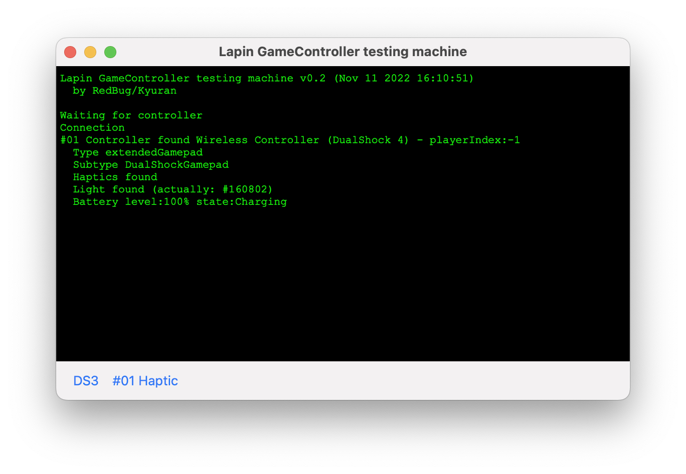

# Lapin GameController testing machine

November 9, 2022, [Pierre Dandumont](https://github.com/Dandumontp) asks for [help](https://www.journaldulapin.com/2022/11/09/aidez-moi-un-programme-pour-tester-les-manettes-mfi/) for an application to test MFI Game Controllers on iOS & macOSX.

8 years ago, I already created a mfi tester for him but in 8 years, Apple have increased a lot the MFI Game Controllers functionnalities.

After a few days, here is my application.

